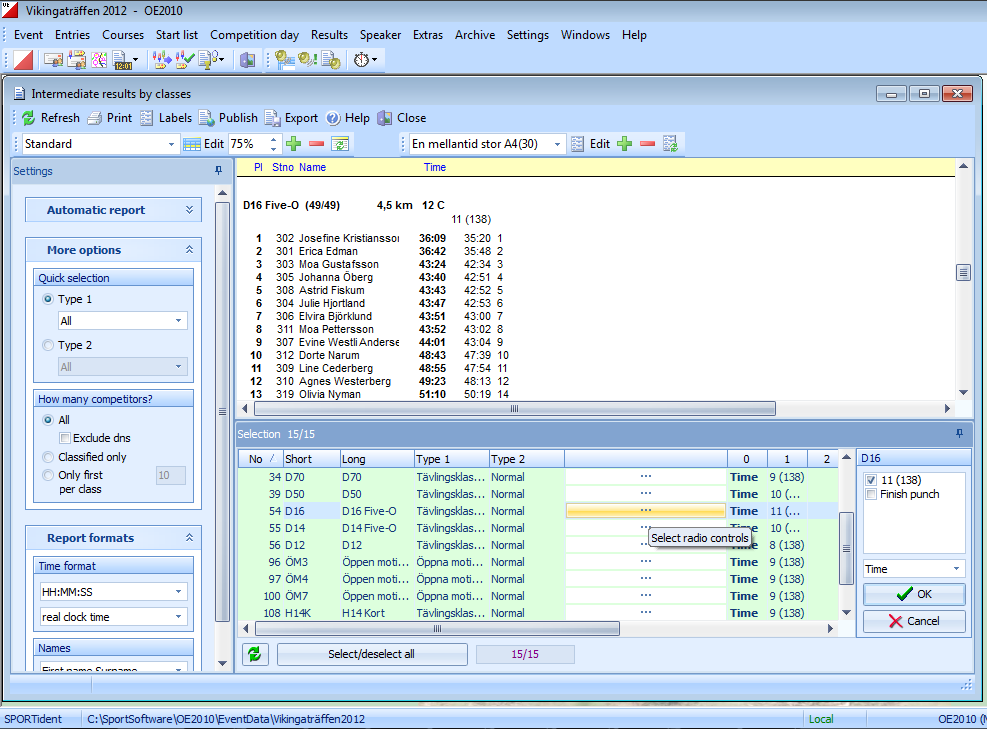
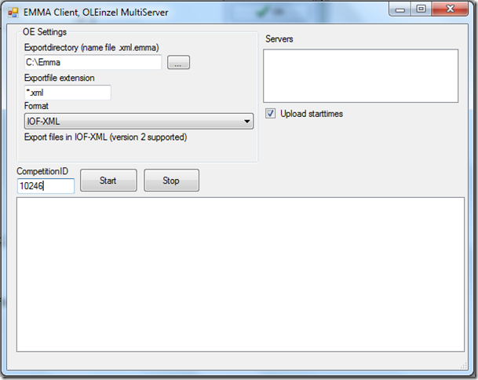

# Uploading Live Results from SportSoftware (OE/OS)
This guide explains how to upload live results when using SportSoftware products for event administration (http://www.sportsoftware.de)

Live results are commonly used at major events where elite classes have several radio controls. But it may also be interesting to publish the final times for smaller events, without having any radio controls

## Preparation
* Visit http://liveresultat.orientering.se/adm/admincompetitions.php and define the competition.
* Make a note about the CompetitionID. 
* Download LiveResults Client from https://liveresults.github.io/documentation/ and install it.
* Create a folder for the export file from OE/OS such as C:\Temp\Liveresults

## Preparation in OE2010
First, define classes and courses as usual.
### Competition without Radio Controls, where only the end times are displayed:
* Select the classes to be displayed using the Results / Preliminary / Classes. 
* Select the classes to be displayed in the selection table at the bottom. 
Note! Don’t select classes that have no classification, i.e. Inskolning in order not to show the times for these classes on live results

### Competition with radio controls:
* Define Radio Controls in the function Speaker / Radio Controls 
* Define the classes and split times to be displayed in the function Speaker / Intermediate Results 
* Don’t select classes that have no classification, i.e. Inskolning in order not to show the times for these classes on live results. 
* The classes whose courses have radio controls are selectable in the selection table at the bottom. 
* Press ... to select the radio controls per class. 

### At the competition day
* Visit http://liveresultat.orientering.se/adm/admincompetitions.php and make the competition visible to visitors. Mark Public and press Save. 
* Start the LiveResults.Client. Choose XML and OE/OS. 

