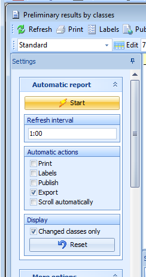
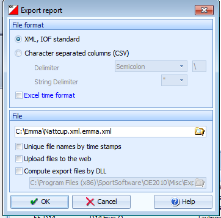

# Uploading Live Results from SportSoftware (OE/OS)
This guide explains how to upload live results when using SportSoftware products for event administration (http://www.sportsoftware.de)

Live results are commonly used at major events where elite classes have several radio controls. But it may also be interesting to publish the final times for smaller events, without having any radio controls

## Preparation
* Visit http://liveresultat.orientering.se/adm/admincompetitions.php and define the competition.
* Make a note about the CompetitionID. 
* Download LiveResults Client from https://liveresults.github.io/documentation/ and install it.
* Create a folder for the export file from OE/OS such as C:\Temp\Liveresults

## Preparation in OE2010
First, define classes and courses as usual.
### Competition without Radio Controls, where only the end times are displayed:
* Select the classes to be displayed using the Results / Preliminary / Classes. 
* Select the classes to be displayed in the selection table at the bottom. 
Note! Don’t select classes that have no classification, i.e. Inskolning in order not to show the times for these classes on live results

### Competition with radio controls:
* Define Radio Controls in the function Speaker / Radio Controls 
* Define the classes and split times to be displayed in the function Speaker / Intermediate Results 
* Don’t select classes that have no classification, i.e. Inskolning in order not to show the times for these classes on live results. 
* The classes whose courses have radio controls are selectable in the selection table at the bottom. 
* Press ... to select the radio controls per class. 

### At the competition day
* Visit http://liveresultat.orientering.se/adm/admincompetitions.php and make the competition visible to visitors. Mark Public and press Save. 
* Start the LiveResults.Client. Choose XML and OE/OS. 

* Enter the location of OE's export files in the field, Exportdirectory, i.e C:\Temp\LiveResults 
* Enter the CompetitionID from live server in the field CompetitionID 
* Select the desired data format for the export file from OE2010 
- IOF XML – the general file format that always works. IOF-xml v2/v3 
- OE-csv – OE2010 
- OSSpeaker-csv – OS2010 
* Then press the Start button to start the transfer to the live server

## In OE2010
* For a competition **without radio controls**, open the function Results / Preliminary / Classes. 
* For a competition **with radio controls**, open the function Speaker / Intermediate times 
* Expand Automatic report in the Settings panel to the left. 
* Select the update interval. Default is 1:00 = 1 minute. The shortest possible interval is 0:10 = 10 seconds. Shorter time will give better service, but more demanding for the computers and internet access. Note. If the file hasn’t been uploaded before a new one is written, then Emma will stop. Selet a longer update interval! 
* Select the automatic action Export only. 
* Choose "Changed classes only" to reduce the data flow. This option is not available for Intermediate times. 
* Use the Time format HH: MM: SS 

Then press the Start button to begin export of end times. A dialog box will open where the export file specified.

Choose to save the report at the place and in the format selected in LiveResults.Client
It is possible in LiveResults.Client to set the extension to look for in the export directory, make sure this is set to the same extension as you are exporting files as.
Online results will be published on  http://liveresultat.orientering.se/
